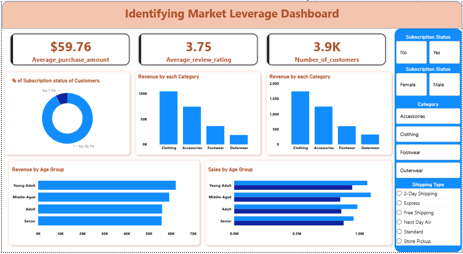

# Identifying Market Leverage

This repository contains resources and tools for analyzing customer behavior and identifying market leverage opportunities. The project focuses on processing customer shopping data, performing exploratory data analysis, and generating insights to support business decisions.

## Repository Structure

The repository is organized as follows:

### 1. **Dashboard/**

This directory is intended for dashboard-related files. It may include visualizations, reports, or tools for presenting insights derived from the analysis.

### 2. **Data/**

Contains the raw and cleaned datasets used for analysis:

- `customer_shopping_dataset.csv`: The raw dataset containing customer shopping data.
- `cleaned_customer_shopping_dataset.csv`: The cleaned version of the dataset, prepared for analysis.

### 3. **Notebook/**

Contains Jupyter Notebooks for data analysis:

- `Customer_Behaviour_Analysis.ipynb`: A notebook that performs exploratory data analysis (EDA) and derives insights from the customer shopping dataset.

### 4. **Sql/**

Contains SQL queries used for data analysis:

- `Business_queries.sql`: A collection of SQL queries designed to extract insights and answer business-related questions from the dataset.

### 5. **README.md**

This file provides an overview of the project and its structure.

### 6. **.gitignore**

Specifies files and directories to be ignored by Git.

## Getting Started

### Prerequisites

- Conda (Anaconda or Miniconda)
- Jupyter Notebook
- SQL database (if running SQL queries)
- Required Python libraries (e.g., pandas, matplotlib, seaborn, etc.)

### Installation

1. Clone the repository:
   ```bash
   git clone https://github.com/chiragtyagi880/Identifying-market-leverage.git
   ```
2. Navigate to the project directory:
   ```bash
   cd Identifying-market-leverage
   ```
3. Create a Conda environment and install the required libraries:
   ```bash
   conda create --name market_leverage_env python=3.9
   conda activate market_leverage_env
   pip install -r requirements.txt
   ```

### Usage

1. Activate the Conda environment:
   ```bash
   conda activate market_leverage_env
   ```
2. Open the Jupyter Notebook:
   ```bash
   jupyter notebook Notebook/Customer_Behaviour_Analysis.ipynb
   ```
3. Run the SQL queries in `Sql/Business_queries.sql` using your preferred SQL database(I used Postgresql).

### Data

The dataset contains customer shopping data, which includes information about customer behavior, purchases, and other relevant metrics. The cleaned dataset is used for analysis.

### Dashboard Preview



# Insights and Strategic Decisions

### 1. **Customer Segmentation and Targeting**

- **Insight:** Segment customers into *New*, *Returning*, and *Loyal* based on their purchase history (Query 7).
- **Strategy:**
  - Design personalized marketing campaigns for each segment:
    - *New Customers*: Offer welcome discounts to encourage repeat purchases.
    - *Returning Customers*: Provide loyalty rewards to increase retention.
    - *Loyal Customers*: Upsell premium products or exclusive offers.
  - Allocate marketing budgets based on the size and revenue contribution of each segment.

### 2. **Subscription Model Optimization**

- **Insight:** Subscribed customers spend more on average compared to non-subscribers (Query 5).
- **Strategy:**
  - Promote subscription plans to high-value customers (e.g., repeat buyers with >5 purchases, Query 9).
  - Offer subscription discounts or perks (e.g., free shipping, exclusive deals) to incentivize sign-ups.

### 3. **Product Portfolio Management**

- **Insight:** Identified top-performing products by average review rating (Query 3) and most purchased products within each category (Query 8).
- **Strategy:**
  - Focus on promoting top-rated products in marketing campaigns.
  - Optimize inventory for the most purchased products in each category.
  - Discontinue or improve underperforming products based on sales and reviews.

### 4. **Discount Strategy**

- **Insight:** Products with the highest percentage of discounted purchases (Query 6) and customers who spend more despite discounts (Query 2).
- **Strategy:**
  - Evaluate the profitability of discounts on high-purchase products.
  - Target discounts to price-sensitive customers or low-performing products to boost sales.
  - Avoid over-discounting high-demand products to protect margins.

### 5. **Shipping Optimization**

- **Insight:** Compared average purchase amounts between Standard and Express shipping (Query 4).
- **Strategy:**
  - Encourage customers to choose Express shipping by offering free or discounted rates for high-value orders.
  - Analyze shipping costs and delivery times to optimize logistics and improve customer satisfaction.

### 6. **Revenue by Demographics**

- **Insight:** Revenue contribution by gender (Query 1) and age group (Query 10).
- **Strategy:**
  - Tailor marketing campaigns to the highest revenue-generating demographics.
  - Identify underperforming demographics and create targeted promotions to increase engagement.

### 7. **Customer Retention**

- **Insight:** Repeat buyers (more than 5 purchases) and their likelihood to subscribe (Query 9).
- **Strategy:**
  - Implement retention programs for repeat buyers, such as exclusive loyalty tiers or early access to new products.
  - Use predictive analytics to identify customers at risk of churn and target them with retention offers.

### 8. **Category-Specific Promotions**

- **Insight:** Top 3 most purchased products within each category (Query 8).
- **Strategy:**
  - Run category-specific promotions to boost sales in underperforming categories.
  - Bundle top-performing products with complementary items to increase basket size.

## License

This project is licensed under the [MIT License](LICENSE).
